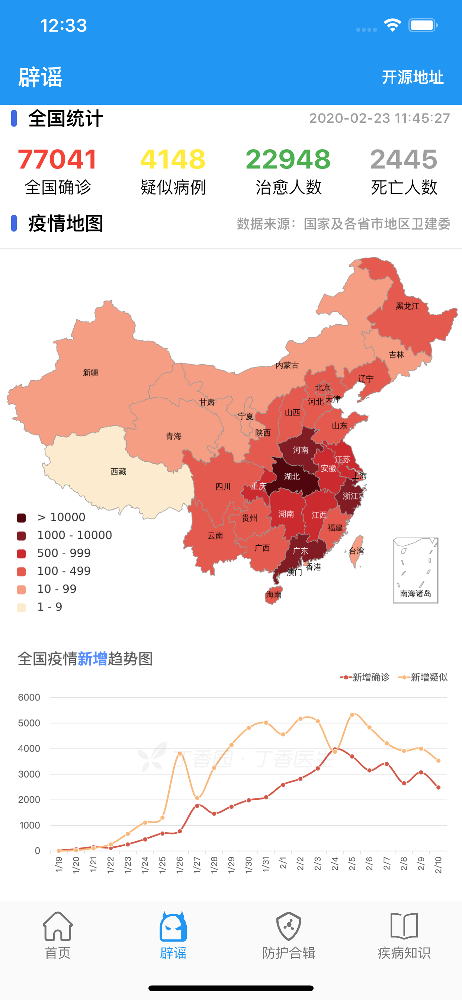
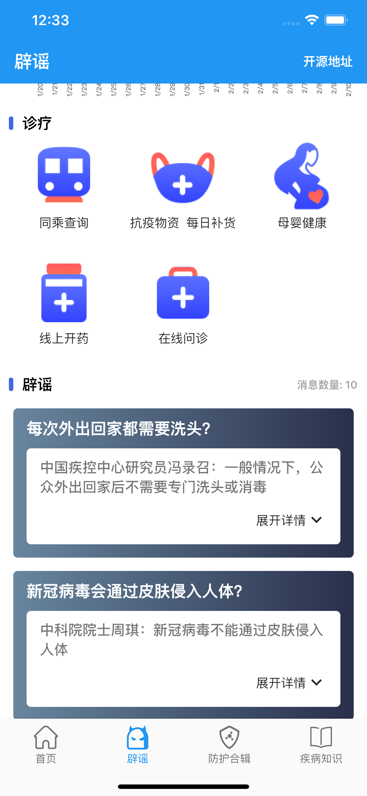
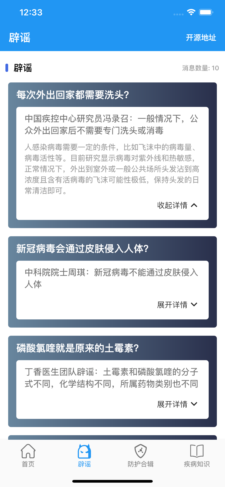
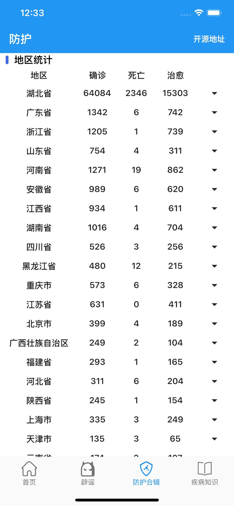
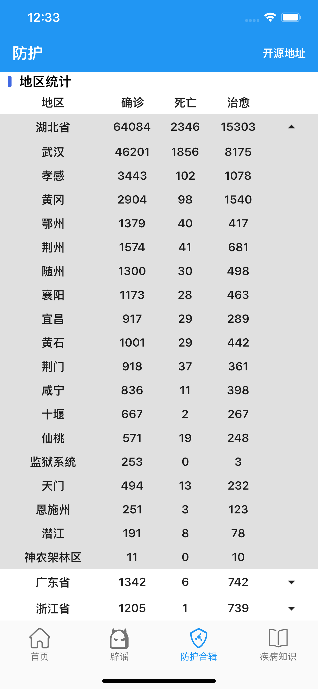
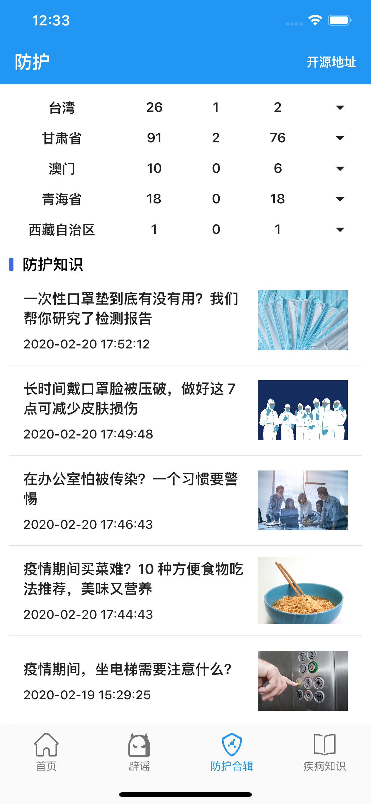

[toc]
# 项目简介

获取冠状肺炎实时动态App，支持Android和iOS, 本项目是在Flutter version 1.12.13的基础下开发完毕，如果是1.9.1版本的 cached_network_image需要修改为1.1.1版本即可

## App效果图















## 使用须知
在pubspec.yaml文件中，关于flutter版本使用cached_network_image插件问题，默认使用2.0.0(Flutter1.12.13+)

```
#cached_network_image: 1.1.1 # 1.9.0左右flutter版本的用这个
cached_network_image: 2.0.0 # 2.0.0左右flutter版本直接用这个
```
  
## 使用教程
```
使用命令（拉取项目）：git clone https://github.com/lizhaohong/WuHanFightingFlutter.git
然后命令（获取依赖）：flutter packages get (iOS执行iOS部分再执行下一步)
最后命令（运行）：$ flutter run
```